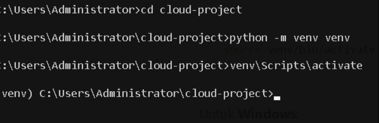
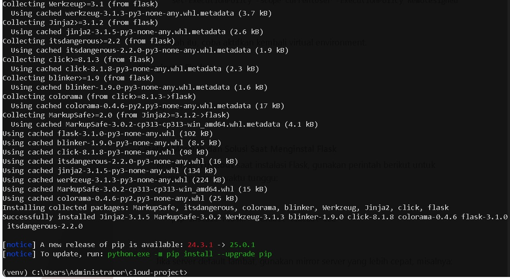
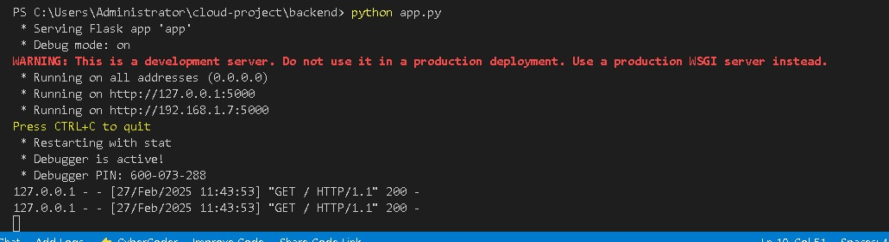
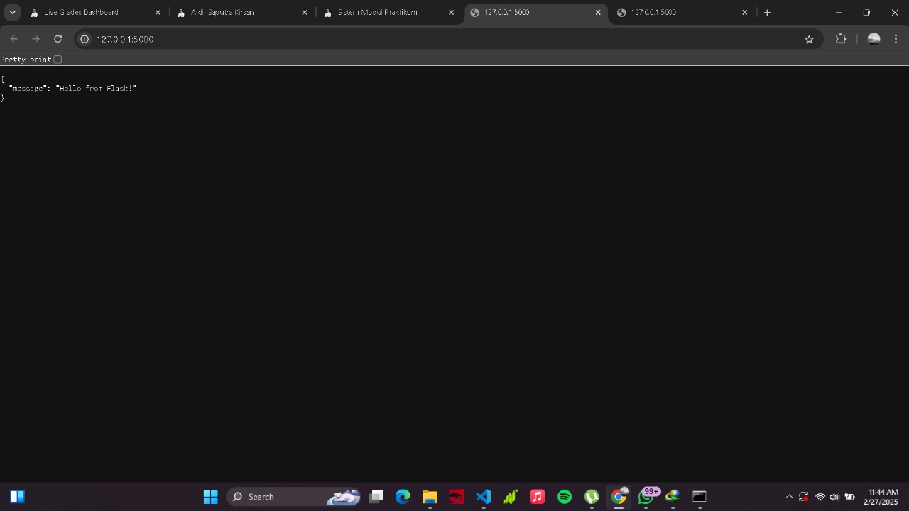
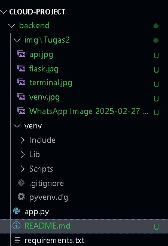

# 10221088_Sheva_Aryo_Susanto_Tugas 2

# Nama : Sheva Aryo Susanto
# NIM  : 10221088

# 1. Virtual Environtment

## Dalam dokumentasi ini Virtual Environtment telah diaktifkan

# 2. Instalasi Flask

## Dalam dokumentasi ini Flask telah terinstal

# 3. Menjalankan Flask

## Dalam dokumentasi ini Flask telah dijalankan

# 4. Request Ke Endpoint 

## Dalam Dokumentasi ini API Flask sudah muncul

# Struktur Folder
