# Nama : Sheva Aryo Susanto
# NIM : 10221088

# Tugas WEEK 5

# 1. Instalasi Psycopg2 

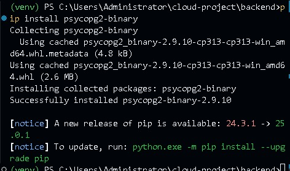

Gambar ini menampilkan proses instalasi paket Python psycopg2-binary menggunakan pip. Paket ini adalah adapter PostgreSQL untuk Python yang memungkinkan aplikasi Python untuk berinteraksi dengan basis data PostgreSQL. Proses instalasi menunjukkan bahwa paket berhasil diinstal dengan versi 2.9.10. Selain itu, terdapat pemberitahuan bahwa versi pip yang lebih baru tersedia, yang menunjukkan bahwa pengguna dapat memperbarui pip untuk mendapatkan fitur dan perbaikan terbaru.

# 2. Verifikasi Instalasi

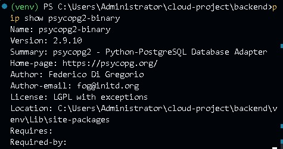

Gambar ini menampilkan informasi tentang paket psycopg2-binary yang telah diinstal, termasuk versi, penulis, dan lokasi instalasi. Informasi ini berguna untuk memverifikasi bahwa paket telah diinstal dengan benar dan untuk memahami dependensi yang diperlukan oleh paket tersebut. Ini juga menunjukkan bahwa paket ini adalah adapter PostgreSQL untuk Python, yang memungkinkan aplikasi Python untuk berinteraksi dengan basis data PostgreSQL.

# 3. Membuat Database

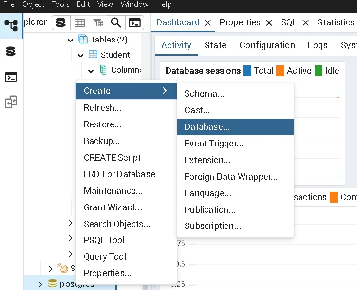
Gambar ini menampilkan antarmuka pengguna dari sebuah alat manajemen basis data, kemungkinan besar pgAdmin atau alat serupa yang digunakan untuk mengelola PostgreSQL. Antarmuka ini menyediakan berbagai opsi untuk mengelola basis data, seperti membuat tabel, melihat aktivitas basis data, dan melakukan tugas administratif lainnya. Terdapat daftar tabel seperti "Student" dan "Activity" yang menunjukkan struktur basis data yang sedang dikelola. Opsi seperti "Create", "Refresh", "Restore", dan "Backup" memungkinkan pengguna untuk melakukan operasi dasar pada basis data. Selain itu, terdapat opsi untuk menghasilkan skrip SQL, melakukan pemeliharaan, dan menggunakan alat query untuk berinteraksi dengan basis data.

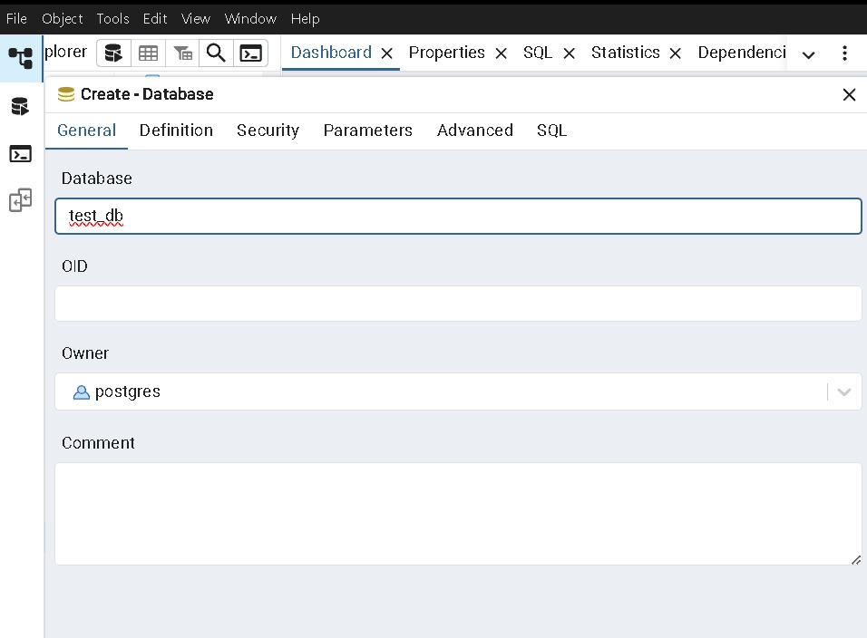
Gambar ini menunjukkan proses pembuatan basis data baru dengan nama "test_db" menggunakan PostgreSQL. Pengguna dapat menentukan berbagai parameter seperti nama basis data, pemilik basis data (dalam hal ini "postgres"), dan menambahkan komentar jika diperlukan. Proses ini melibatkan pengisian formulir yang mencakup tab "General", "Definition", "Security", "Parameters", dan "Advanced". Setiap tab memungkinkan pengguna untuk mengkonfigurasi aspek tertentu dari basis data yang akan dibuat, seperti hak akses, parameter kinerja, dan opsi lanjutan lainnya.

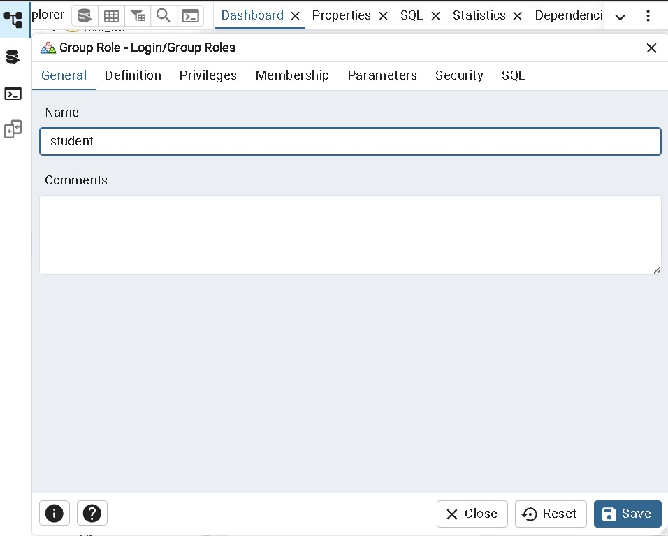
Gambar ini menampilkan antarmuka untuk membuat peran (role) dalam basis data, seperti peran "student". Peran dalam PostgreSQL digunakan untuk mengelola hak akses dan keistimewaan pengguna. Pengguna dapat menentukan definisi peran, hak istimewa yang dimiliki, keanggotaan dalam grup lain, dan parameter keamanan. Proses ini penting untuk memastikan bahwa setiap pengguna atau aplikasi yang mengakses basis data memiliki hak akses yang sesuai dengan kebutuhan mereka.

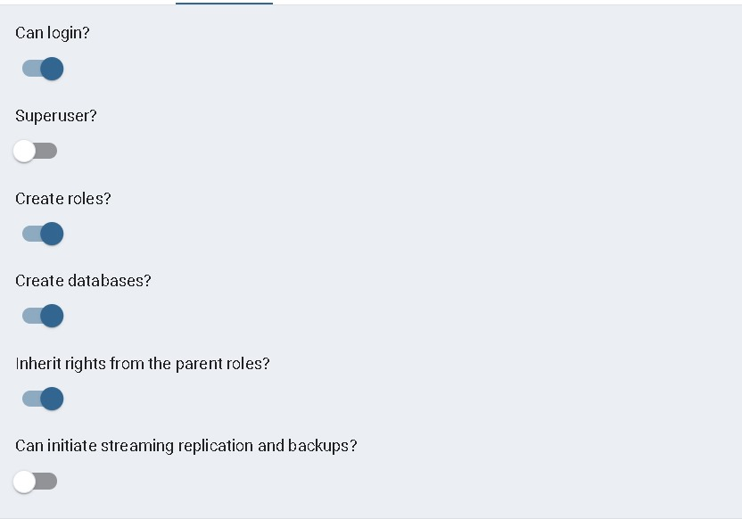
Gambar ini melanjutkan proses pembuatan peran dengan opsi tambahan seperti menentukan apakah peran dapat login, memiliki hak superuser, atau dapat membuat basis data dan peran lain. Opsi ini memungkinkan administrator basis data untuk mengontrol secara ketat siapa yang dapat melakukan operasi administratif dan operasi sensitif lainnya. Misalnya, mencentang "Superuser?" akan memberikan peran tersebut hak akses penuh ke seluruh basis data.

# 4. Membuat Koneksi Database di app.py

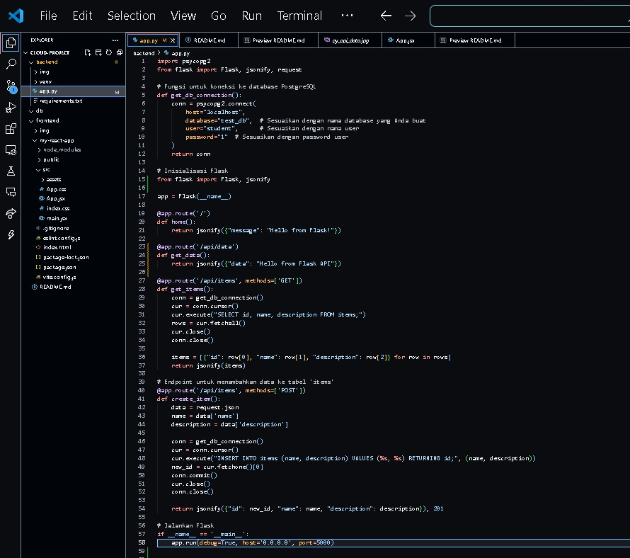

Gambar ini menampilkan kode Python yang digunakan untuk membuat aplikasi Flask yang terhubung ke basis data PostgreSQL. Kode ini diawali dengan mengimpor library yang diperlukan, seperti psycopg2 untuk menghubungkan aplikasi Python dengan basis data PostgreSQL dan Flask untuk membuat aplikasi web. Fungsi get_db_connection() digunakan untuk membuat koneksi ke basis data PostgreSQL dengan parameter seperti host, nama basis data (test_db), pengguna (student), dan password (1). Aplikasi Flask diinisialisasi dengan nama app, dan terdapat beberapa endpoint dasar, seperti / yang mengembalikan pesan JSON {"message": "Hello from flask!"} dan /api/data yang mengembalikan pesan JSON {"data": "Hello from flask API"}. Namun, berdasarkan log di terminal, endpoint /api/data belum diimplementasikan dengan benar, sehingga mengembalikan status 404.

Endpoint /api/items dengan metode GET digunakan untuk mengambil data dari tabel items di basis data. Endpoint ini membuka koneksi ke basis data, mengeksekusi query SQL SELECT id, name, description FROM items;, mengambil hasil query, dan mengonversinya menjadi format JSON sebelum mengembalikannya sebagai respons. Endpoint /api/items dengan metode POST digunakan untuk menambahkan data baru ke tabel items. Endpoint ini menerima data JSON dari body permintaan yang berisi name dan description, membuka koneksi ke basis data, mengeksekusi query SQL INSERT INTO items (name, description) VALUES (%s, %s) RETURNING id;, mengambil ID baru yang dihasilkan, melakukan commit untuk menyimpan perubahan, dan mengembalikan data yang baru ditambahkan dalam format JSON dengan status 201 Created.

Aplikasi Flask dijalankan dengan mode debug aktif, di-host di semua alamat IP (0.0.0.0), dan berjalan pada port 5000. Kode ini menggabungkan penggunaan Flask untuk membuat API dan psycopg2 untuk berinteraksi dengan basis data PostgreSQL, sehingga membentuk aplikasi web sederhana yang dapat melakukan operasi CRUD (Create, Read) pada basis data. Secara keseluruhan, gambar-gambar ini mencakup berbagai aspek pengelolaan basis data PostgreSQL dan pengembangan aplikasi web, termasuk pembuatan basis data, manajemen peran, pengujian API, dan instalasi paket Python yang diperlukan.

# 5. Menjalankan dan Menguji
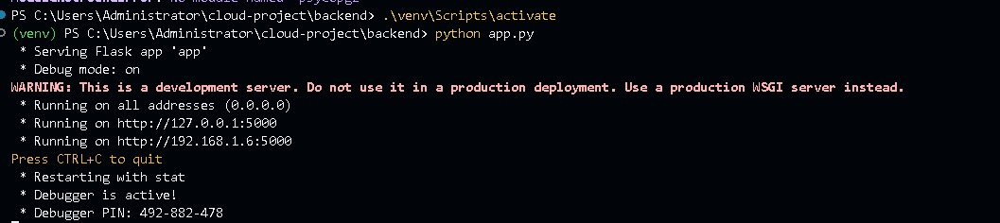

Gambar ini menampilkan output terminal yang menunjukkan proses menjalankan aplikasi Flask dalam lingkungan pengembangan. Pada baris pertama, virtual environment diaktifkan menggunakan perintah .\venv\Scripts\activate, yang mengisolasi dependensi proyek Python agar tidak bertabrakan dengan proyek lain. Setelah virtual environment aktif, aplikasi Flask dijalankan dengan perintah python app.py, yang menunjukkan bahwa file utama aplikasi adalah app.py. Aplikasi Flask dengan nama app dijalankan dalam mode debug, yang memungkinkan pengembang untuk melihat perubahan kode secara real-time tanpa perlu me-restart server secara manual. Terdapat peringatan bahwa server ini adalah server pengembangan dan tidak disarankan untuk digunakan dalam lingkungan produksi. Sebagai gantinya, disarankan menggunakan server WSGI seperti Gunicorn atau uWSGI untuk keperluan produksi.

Server Flask berjalan di semua alamat IP (0.0.0.0), yang berarti dapat diakses dari mana saja dalam jaringan. Alamat spesifik yang ditampilkan adalah http://127.0.0.1:5000 untuk localhost dan http://192.168.1.6:5000 untuk akses melalui jaringan lokal. Debugger juga aktif dengan PIN 492-882-478, yang dapat digunakan untuk mengakses fitur debug Flask jika terjadi kesalahan selama pengembangan. Pesan "Restarting with stat" menunjukkan bahwa server melakukan restart secara otomatis karena perubahan pada kode atau file yang dimonitor oleh Flask dalam mode debug. Gambar ini memberikan gambaran yang jelas tentang bagaimana aplikasi Flask dijalankan dan diakses selama proses pengembangan.

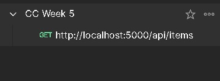

Gambar ini menunjukkan penggunaan perintah curl untuk melakukan permintaan HTTP GET ke endpoint http://localhost:5000/api/items. Perintah curl adalah alat baris perintah yang digunakan untuk mentransfer data dari atau ke server. Dalam konteks ini, permintaan GET digunakan untuk mengambil data dari API yang berjalan di localhost pada port 5000. Ini mungkin merupakan bagian dari pengujian atau integrasi API dalam pengembangan aplikasi.

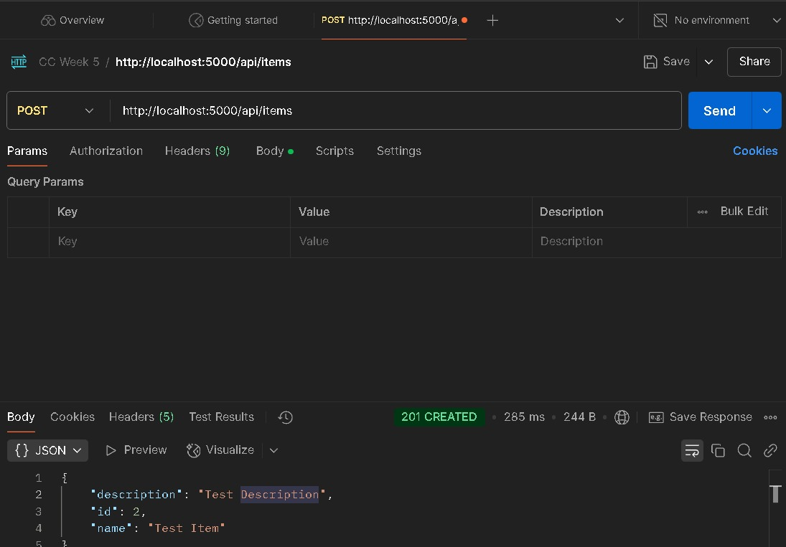

Gambar ini menunjukkan permintaan HTTP POST ke endpoint http://localhost:5000/api/items dengan body JSON yang berisi deskripsi dan nama item. Permintaan POST digunakan untuk mengirim data ke server untuk membuat atau memperbarui sumber daya. Respons menunjukkan bahwa item berhasil dibuat dengan status 201 CREATED, yang berarti permintaan berhasil dan sumber daya baru telah dibuat. Waktu respons dan ukuran data juga ditampilkan, memberikan informasi tentang kinerja API.

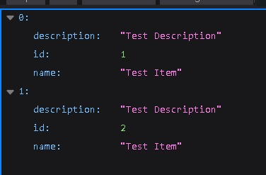

Gambar ini menampilkan informasi tentang paket psycopg2-binary yang telah diinstal, termasuk versi, penulis, dan lokasi instalasi. Informasi ini berguna untuk memverifikasi bahwa paket telah diinstal dengan benar dan untuk memahami dependensi yang diperlukan oleh paket tersebut. Ini juga menunjukkan bahwa paket ini adalah adapter PostgreSQL untuk Python, yang memungkinkan aplikasi Python untuk berinteraksi dengan basis data PostgreSQL.