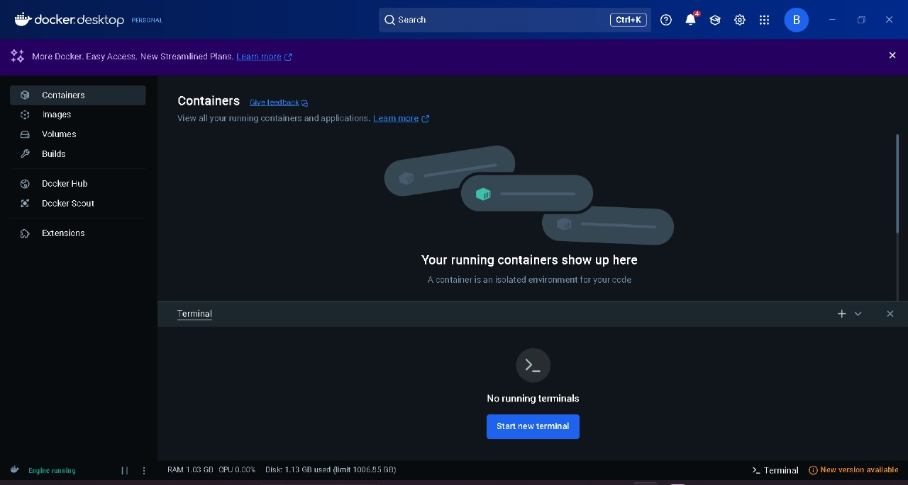
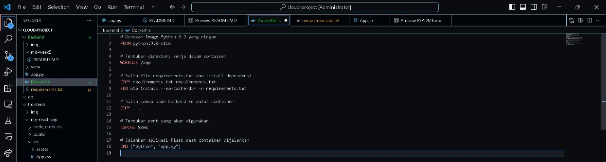
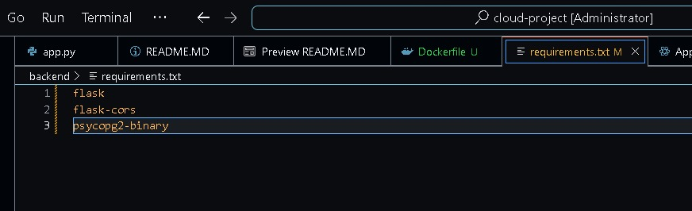
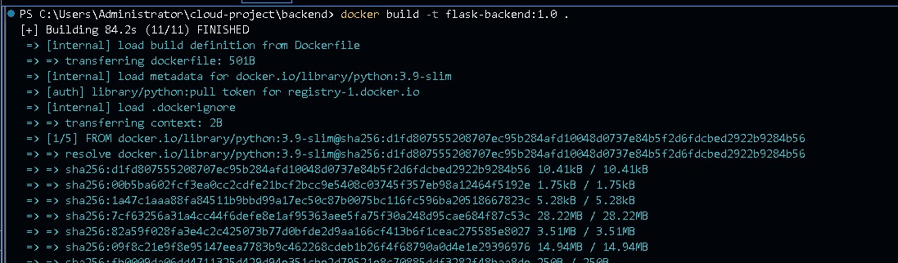

# TUGAS WEEK 6 CC
NAMA : Sheva Aryo Susanto
NIM : 10221088

# 1. Open Docker

Pada Gambar ini,Docker dijalankan agar engine localhost dari Docker bisa digunakan

# 2. Membuat Dockerfile

Dockerfile ini digunakan untuk membuat image Docker yang akan menjalankan aplikasi backend Python. Berikut penjelasan langkah-langkahnya:

## FROM python:3.9-slim
Image Docker ini menggunakan base image Python 3.9 dengan versi slim yang ringan. Versi slim mengurangi ukuran image dengan menghapus file-file yang tidak diperlukan.

## WORKDIR /app
Direktori kerja di dalam container diatur ke /app. Semua perintah selanjutnya akan dijalankan di dalam direktori ini.

## COPY requirements.txt requirements.txt
File requirements.txt dari direktori lokal disalin ke dalam direktori /app di dalam container. File ini berisi daftar dependensi Python yang diperlukan untuk menjalankan aplikasi.

## RUN pip install --no-cache-dir -r requirements.txt
Perintah ini menginstal semua dependensi yang tercantum di requirements.txt menggunakan pip. Opsi --no-cache-dir digunakan untuk menghindari penyimpanan cache, sehingga ukuran image tetap kecil.

## COPY . .
Seluruh kode aplikasi dari direktori lokal disalin ke dalam direktori /app di dalam container.

## EXPOSE 5000
Container akan membuka port 5000. Port ini biasanya digunakan untuk aplikasi web backend yang berjalan di Flask atau framework sejenis.

## CMD ["python", "app.py"]
Perintah ini menjalankan aplikasi Python dengan menjalankan file app.py saat container dijalankan. Ini adalah perintah default yang akan dieksekusi ketika container di-start.

# 3. Menyiapkan Requirement

flask==2.3.2: Menginstal Flask versi 2.3.2.

flask-cors==4.0.0: Menginstal Flask-CORS versi 4.0.0 untuk mengaktifkan CORS.
    
psycopg2-binary==2.9.6: Menginstal Psycopg2 versi 2.9.6 (binary) untuk berinteraksi dengan PostgreSQL.

# 4. Build Docker Image

Pertama, perintah cd backend digunakan untuk berpindah ke direktori backend di dalam terminal. Ini diperlukan karena Dockerfile dan file-file proyek backend biasanya disimpan dalam direktori khusus (dalam hal ini, direktori backend). Dengan berpindah ke direktori ini, kita memastikan bahwa semua perintah Docker yang dijalankan selanjutnya akan merujuk pada file-file yang berada di dalam direktori tersebut.

Setelah berada di direktori backend, perintah docker build -t flask-backend:1.0 . dijalankan untuk membangun image Docker. Perintah ini memiliki beberapa komponen penting:

docker build: Ini adalah perintah dasar Docker untuk membangun image dari Dockerfile.

-t flask-backend:1.0: Opsi -t digunakan untuk memberi nama dan tag pada image yang dibangun. Dalam hal ini, image diberi nama flask-backend dengan versi 1.0. Tagging ini membantu mengidentifikasi image dengan mudah, terutama jika ada beberapa versi image yang berbeda.

.: Tanda titik (.) di akhir perintah menunjukkan bahwa Dockerfile dan konteks build (file-file yang diperlukan) berada di direktori saat ini, yaitu direktori backend.

Setelah perintah ini dijalankan, Docker akan membaca Dockerfile di direktori backend, mengikuti instruksi di dalamnya (seperti menginstal dependensi, menyalin file aplikasi, dan mengekspos port), dan menghasilkan image siap pakai dengan nama flask-backend:1.0. Image ini kemudian dapat digunakan untuk menjalankan container yang akan menghosting aplikasi backend Flask.

# 5. Run Docker Container

Perintah docker run adalah perintah utama Docker untuk menjalankan container dari sebuah image. Dalam hal ini, image yang digunakan adalah flask-backend:1.0, yang telah dibangun sebelumnya menggunakan perintah docker build. Opsi -d (detached mode) digunakan untuk menjalankan container di latar belakang (background), sehingga terminal tidak terikat ke proses container dan Anda dapat melanjutkan menggunakan terminal untuk perintah lain.

Opsi -p 5000:5000 melakukan pemetaan port antara host (mesin lokal atau server) dan container. Angka pertama (5000) adalah port yang digunakan di host, sedangkan angka kedua (5000) adalah port yang digunakan di dalam container. Ini berarti aplikasi Flask yang berjalan di dalam container pada port 5000 dapat diakses dari luar melalui port 5000 pada host.

Opsi --name flask-container memberikan nama khusus (flask-container) kepada container yang dijalankan. Memberikan nama memudahkan Anda untuk mengelola container (seperti memulai, menghentikan, atau menghapusnya) tanpa harus mengingat ID container yang panjang.

Terakhir, flask-backend:1.0 adalah nama image yang digunakan untuk menjalankan container. Image ini harus sudah ada di sistem lokal Anda, baik karena telah dibangun sebelumnya atau di-pull dari Docker Registry.

Dengan menjalankan perintah ini, container akan berjalan di latar belakang, dan aplikasi Flask di dalamnya akan dapat diakses melalui http://localhost:5000 (atau alamat IP server jika dijalankan di server). Perintah ini sangat berguna untuk deployment aplikasi dalam lingkungan container yang terisolasi dan konsisten.

# 6. Test Aplikasi

Didapati bahwa Docker bisa menjalankan Localhost untuk flask

