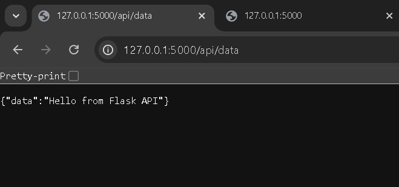

# 10221088_Sheva_Aryo_Susanto_Tugas 3

# Nama : Sheva Aryo Susanto
# NIM  : 10221088

# 1. Menambahkan Endpoint di Flask

Gambar ini menunjukkan bagian dari kode pada file app.py yang mendefinisikan dua rute: satu di / untuk mengembalikan pesan, dan satu lagi di /api/data untuk mengembalikan data dari API. Kode ini memastikan bahwa setiap rute berfungsi semenjak aplikasi dijalankan.

Di sini, tampak respons JSON saat mengakses endpoint /api/data dari aplikasi Flask. Output menunjukkan data dengan pesan "Hello from Flask API", yang menunjukkan bahwa rute tersebut berfungsi dengan baik dan merespons permintaan dari klien.

# 2. Fungsi get_data()

Server Flask dijalankan pada host '0.0.0.0' dan port '5000' dalam mode debug, yang memungkinkan para pengembang untuk melihat perubahan secara langsung.

# 3. Code Flask

File app.py adalah merupakan skrip utama untuk aplikasi Flask. Di dalamnya, terdapat impor pustaka Flask dan CORS untuk mengizinkan interaksi lintas sumber. Aplikasi Flask diinisialisasi dan dua rute didefinisikan: satu untuk mendapatkan pesan dasar dan satu lagi untuk mengambil data dari API. Ketika aplikasi dijalankan, ia mendengarkan pada semua alamat IP di port 5000 dalam mode debug.

# 4. Terminal Flask dan output dari localhost 5000

Di gambar ini, tampak tampilan terminal di mana skrip app.py sedang dijalankan. Pesan menunjukkan bahwa aplikasi Flask dihosting pada alamat http://127.0.0.1:5000/ dan mendukung mode debug. Ini juga mengingatkan bahwa server yang sedang dijalankan adalah untuk pengembangan dan tidak disarankan untuk digunakan di lingkungan produksi.

Bagian ini menunjukkan implementasi bagian terakhir dari app.py, yang memeriksa jika script sedang dijalankan sebagai program utama dan memulai server Flask. Ini adalah cara yang umum untuk mengecek dan mengeksekusi aplikasi Flask.

# 5. localhost api/data

Di sini, tampak respons JSON saat mengakses endpoint /api/data dari aplikasi Flask. Output menunjukkan data dengan pesan "Hello from Flask API", yang menunjukkan bahwa rute tersebut berfungsi dengan baik dan merespons permintaan dari klien.

# 6. Memanggil Endpoint dari React

File ini berisi kode untuk komponen utama React. Di dalamnya, useEffect digunakan untuk melakukan panggilan fetch ke endpoint API Flask dan mengatur data dalam keadaan (state). Jika tidak ada data, komponen menampilkan teks "Loading data...", yang merupakan proses standar untuk menampilkan informasi sementara saat menunggu permintaan API.

Melalui berbagai bagian ini, terlihat bagaimana aplikasi Flask berfungsi sebagai backend dan React sebagai frontend, keduanya berinteraksi untuk membangun aplikasi yang fungsional.

# 7. Menjalankan Aplikasi React dan terminal

Gambar ini menunjukkan output dari terminal yang menjalankan aplikasi React menggunakan Vite. Informasi penting termasuk alamat lokal tempat aplikasi React dihosting (http://localhost:5173/). Ini menunjukkan bahwa aplikasi telah dibangun dan siap untuk diuji.

Gambar ini menunjukkan antarmuka pengguna dari aplikasi frontend yang dibangun dengan React. Display mengungkapkan judul "React & Flask Integration" dan pesan "Hello from Flask API", yang menunjukkan bahwa frontend berhasil mengambil data dari backend Flask.
