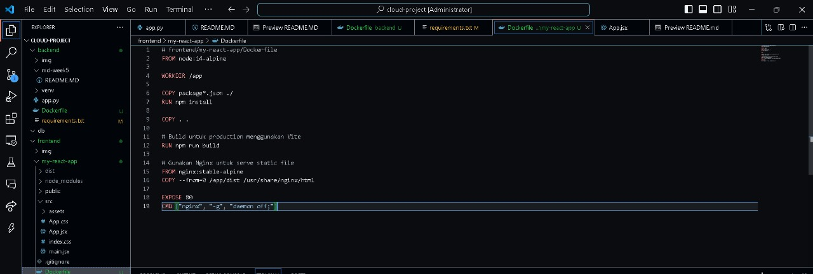
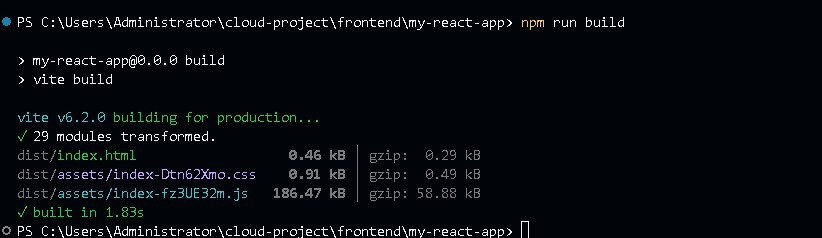
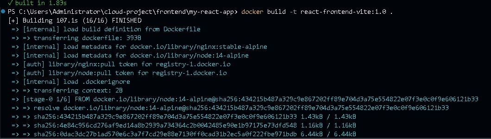
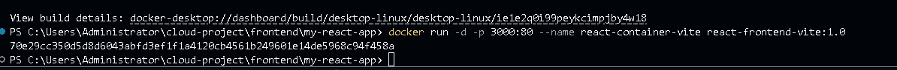
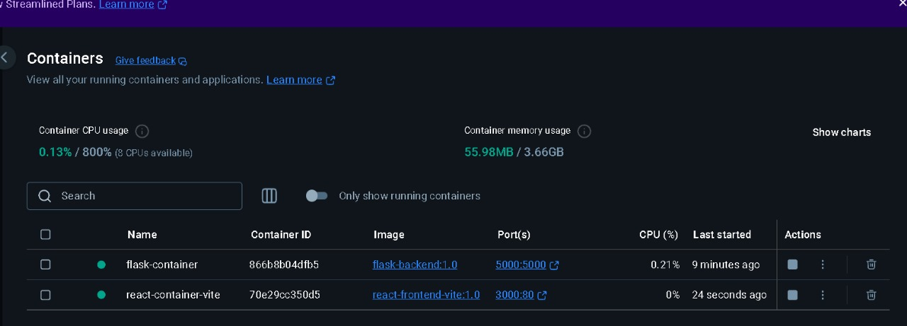
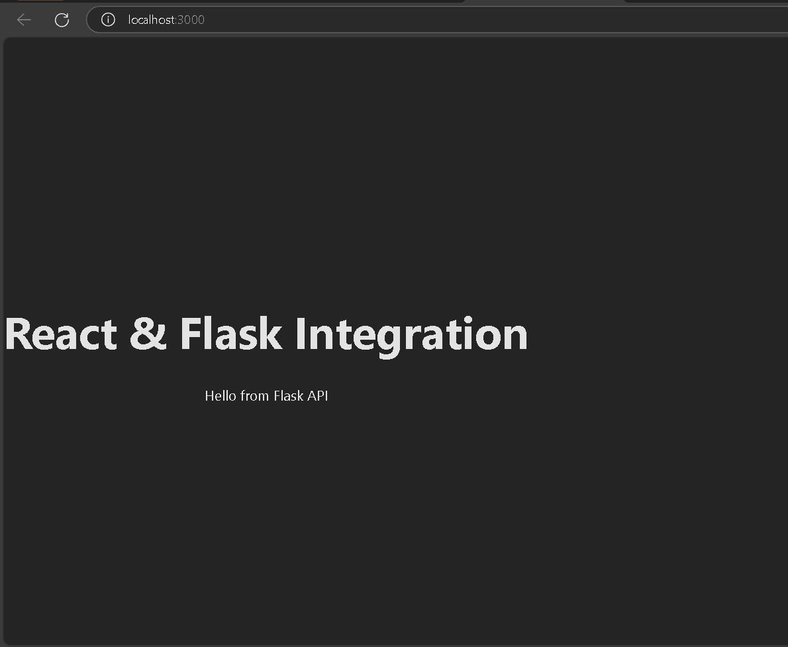
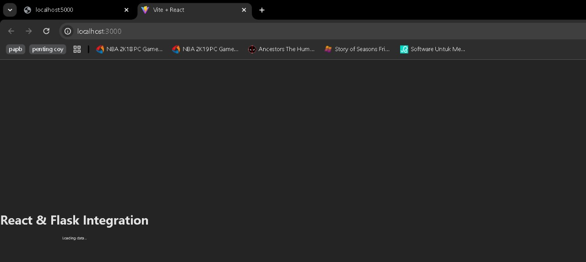

# 10221088_Sheva_Aryo_Susanto_Tugas 7

# Nama : Sheva Aryo Susanto
# NIM  : 10221088

# 1. Membuat file Dockerfile pada Folder Front End

Dockerfile ini digunakan untuk membangun dan menjalankan aplikasi frontend berbasis React yang menggunakan Vite sebagai build tool. Proses dimulai dengan menggunakan Node.js 14 berbasis Alpine sebagai base image untuk membangun aplikasi. Direktori kerja diatur ke /app, lalu file package.json dan package-lock.json disalin ke dalam container untuk menginstal dependencies menggunakan npm install. Setelah itu, seluruh kode sumber disalin, dan aplikasi dibangun menggunakan npm run build, yang menghasilkan file statis di direktori /app/dist.

Setelah proses build selesai, tahap kedua menggunakan Nginx stable-alpine sebagai base image untuk menyajikan hasil build. File yang telah dihasilkan pada tahap pertama disalin ke dalam direktori /usr/share/nginx/html, yang merupakan lokasi default Nginx untuk menyajikan static files. Port 80 diekspos agar container dapat menerima trafik HTTP, dan perintah CMD ["nginx", "-g", "daemon off;"] digunakan untuk menjalankan Nginx dalam mode foreground agar tetap aktif saat container berjalan.

Pendekatan ini menggunakan multi-stage build, yang membuat image akhir lebih ringan karena hanya menyertakan hasil build dan Nginx tanpa Node.js. Selain itu, menggunakan Nginx untuk menyajikan static files lebih efisien dibandingkan menjalankan server berbasis Node.js, sehingga meningkatkan performa aplikasi saat dijalankan dalam container.

# 2. Fungsi dari npm run build

Perintah npm run build digunakan untuk membangun aplikasi React berbasis Vite agar siap untuk produksi. Saat perintah ini dijalankan, Vite akan mengoptimalkan kode dengan menghapus bagian yang tidak digunakan (tree shaking), menggabungkan file JavaScript dan CSS, serta melakukan minifikasi agar ukuran file lebih kecil dan efisien. Proses ini menghasilkan file statis yang disimpan di dalam folder dist/, yang berisi HTML, CSS, dan JavaScript yang telah dioptimalkan untuk kecepatan dan performa. File dalam folder dist/ ini siap untuk disajikan oleh server seperti Nginx, Apache, atau CDN, berbeda dengan npm start yang hanya menjalankan aplikasi dalam mode pengembangan. Dengan menggunakan npm run build, aplikasi React dapat berjalan lebih cepat, lebih ringan, dan lebih optimal untuk pengguna akhir.

# 3. Memanggil Docker build

Perintah docker build -t react-frontend-vite:1.0 . digunakan untuk membuat image Docker dari aplikasi React berbasis Vite dengan membaca instruksi yang ada di dalam Dockerfile pada direktori saat ini (.). Proses ini dimulai dengan mengambil base image Node.js untuk menginstal dependencies (npm install) dan membangun aplikasi (npm run build), lalu menggunakan Nginx untuk menyajikan file statis hasil build agar lebih cepat dan efisien. Dengan menambahkan tag (-t), image diberi nama react-frontend-vite dengan versi 1.0, sehingga lebih mudah dikelola dan dijalankan di masa depan. Setelah image berhasil dibuat, kita dapat menjalankan container menggunakan perintah docker run -d -p 8080:80 react-frontend-vite:1.0, yang akan memetakan aplikasi ke port 8080 pada mesin host dan memungkinkan akses melalui http://localhost:8080.

Ke depannya, image ini bisa digunakan untuk deployment ke berbagai lingkungan, seperti Docker Hub, AWS, GCP, atau Kubernetes, sehingga aplikasi bisa berjalan secara konsisten di berbagai platform tanpa perlu menginstal dependencies secara manual. Jika ada pembaruan pada aplikasi, kita cukup membangun ulang image dengan perintah yang sama, menambahkan versi baru (misalnya react-frontend-vite:2.0), lalu menjalankan container yang diperbarui. Dengan pendekatan ini, pengelolaan aplikasi menjadi lebih terstruktur, mudah diotomatisasi, dan siap untuk skala yang lebih besar, baik dalam pengembangan lokal maupun deployment di cloud.

# 4. Run Docker Container

Perintah docker run -d -p 3000:80 --name react-container-vite react-frontend-vite:1.0 digunakan untuk menjalankan container dari image Docker yang telah dibuat sebelumnya. Opsi -d memastikan container berjalan di latar belakang tanpa mengunci terminal, sementara -p 3000:80 melakukan port mapping sehingga aplikasi yang berjalan di dalam container pada port 80 dapat diakses melalui http://localhost:3000. Selain itu, parameter --name react-container-vite memberikan nama khusus pada container agar lebih mudah dikelola dalam berbagai operasi Docker, seperti menghentikan, menjalankan ulang, atau menghapusnya. Image yang digunakan dalam perintah ini adalah react-frontend-vite:1.0, yang sebelumnya telah dibuat menggunakan perintah docker build.

Setelah perintah ini dieksekusi, Docker akan mencari image tersebut di dalam sistem lokal dan menjalankan container dengan konfigurasi yang sesuai. Karena aplikasi React ini telah dibangun menggunakan Vite dan disajikan oleh Nginx, container akan langsung menyajikan file statis hasil build di dalam direktori /usr/share/nginx/html, memungkinkan aplikasi berjalan layaknya website yang dihosting di server produksi. Jika container perlu dikelola lebih lanjut, kita bisa mengeceknya dengan docker ps, menghentikannya dengan docker stop react-container-vite, atau menghapusnya jika tidak diperlukan lagi dengan docker rm react-container-vite.

# 5. Contoh gambar pada container docker

# 6. Output

Pada gambar ini,React sudah bisa dijalankan dalam localhost milik docker dan API dari flask juga muncul pada tampilan yang tertera

# Error Handling

Pada gambar ini.Seharusnya memunculkan API Flask,Akan tetapi API tersebut tidak muncul.Problem yang saya dapati yaitu :
pada error ini saya mengganti struktur pada requirements.txt

blinker==1.9.0
click==8.1.8
colorama==0.4.6
Flask==3.1.0
flask-cors==5.0.1
itsdangerous==2.2.0
Jinja2==3.1.5
MarkupSafe==3.0.2
psycopg2-binary==2.9.10
Werkzeug==3.1.3

yang seharusnya menambah struktur requirement nya seperti diatas,saya menggantinya menjadi seperti di bawah ini :
flask
flask-cors
psycopg2-binary

yang terjadi yaitu API Flask tidak dapat muncul seperti gambar Problem_1.img

