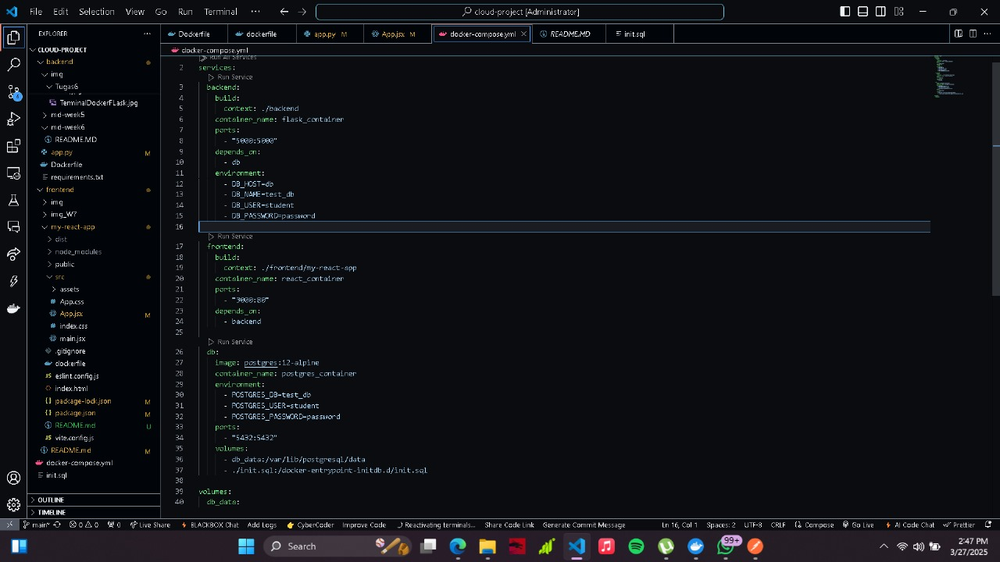
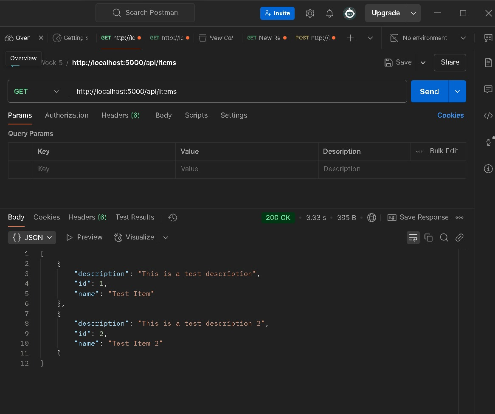
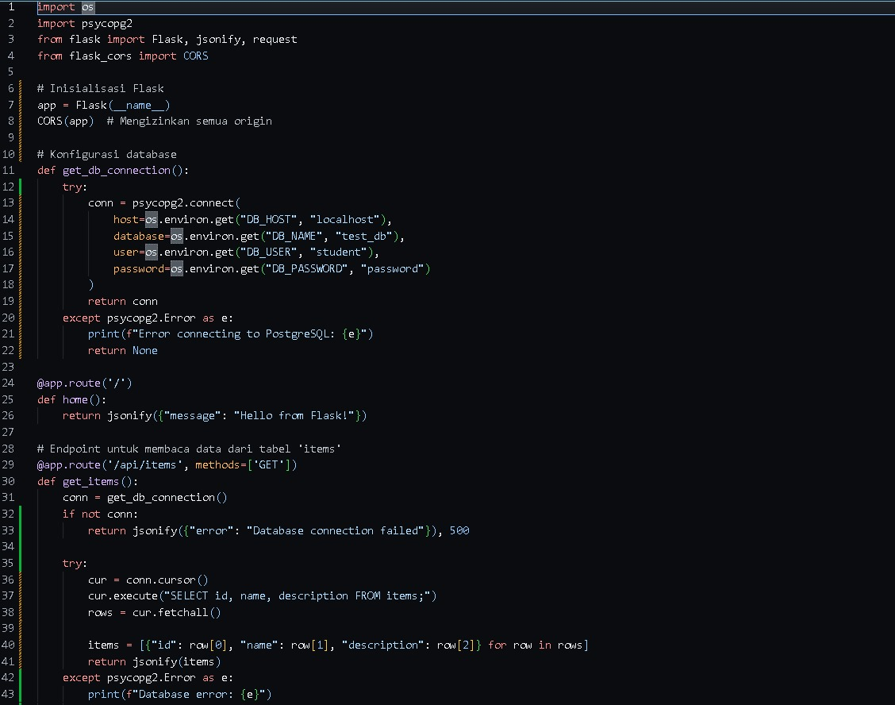
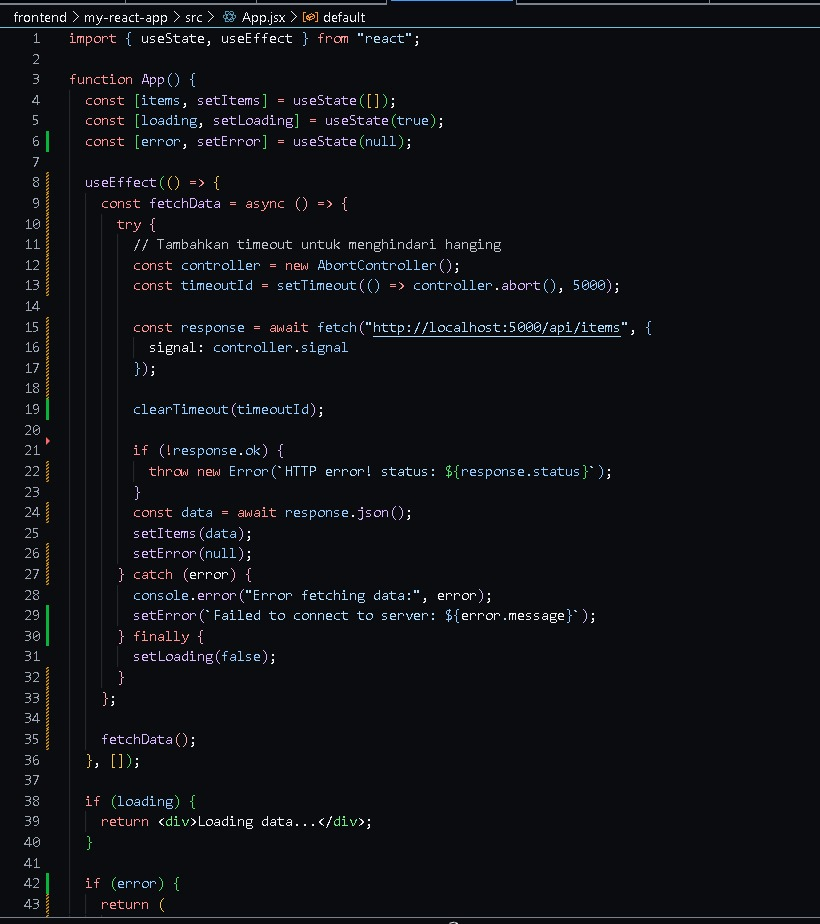
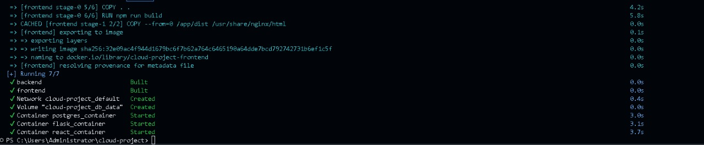
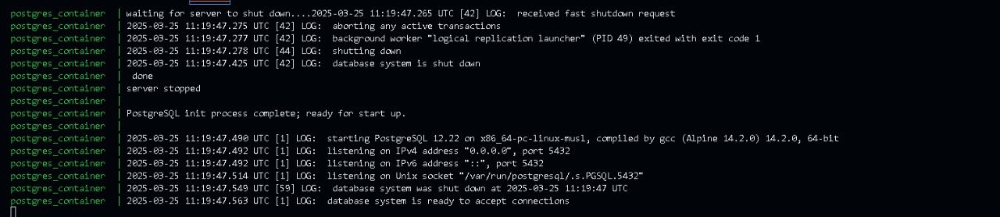

# TUGAS UTS CLOUD COMPUTING

## NAMA : Sheva Aryo Susanto
## NIM  : 10221088

### 1.  Membuat Docker-Compose 

    Pada step pertama yaitu membuat docker-compose agar Docker bisa membuild 
container yang berisi flask,react dan postgreSQL. 

### 2. Membuat file init.sql dan isi Tabel PostgreSQL Sebelumnya 

Step kedua yaitu membuat file init.sql yang berisi “This is a test description” pada table 
items,yang dimana hasil dari table ini akan menjadi output pada tugas ini. 

### 3. Menyesuaikan app.py 

Step ketiga yaitu menambahkan kode dari flask agar tersambung pada database. 

### 4. Menyesuaikan App.jsx (Frontend) 

Pada step ke-4.Mengubah target dari API react yang awalnya api/data.menjadi 
api/items. 

### 5. Menjalankan Docker Compose
 
Step ke-5.menggunakan command docker compose up -d --build untuk 
mengeksport semua kode dari flask,react dan database dari PostgreSQL agar bisa 
dijalankan menjadi satu Container. 

### 6. Output yang telah dihasilkan 

Pada gambar diatas,merupakan output dari tugas ini menggunakan localhost:3000. 

### Problem pada tugas 8 :
1. Pada tahap pengerjaan,output dari Container masih menarik API dari 
api/data.Yang dimana seharusnya pada tugas ini api yang ditarik yaitu 
api/items.berikut gambar yang saya dapati : 

2. Solusi :  
● Step pertama : Mahasiswa menghapus folder dist yang terletak pada 
folder my-react-app,yang dimana folder dist ini berisi history react yang 
sudah pernah dijalankan oleh terminal 
● Step kedua : Menggunakan command npm run build,agar membuat folder 
dist tersedia lagi.Dimana berfungsi agar bisa memanggil api/items 
● Step ketiga : Mahasiswa menghapus Container menggunakan 
docker-compose down,lalu docker-compose up untuk mengeksport folder 
dari cloud-project. 
● Step keempat : Jika output masih memanggil api/data.solusi nya yaitu 
menghapus cache dan mengakses localhost:3000 lagi setelah 
menghapus cache. 
